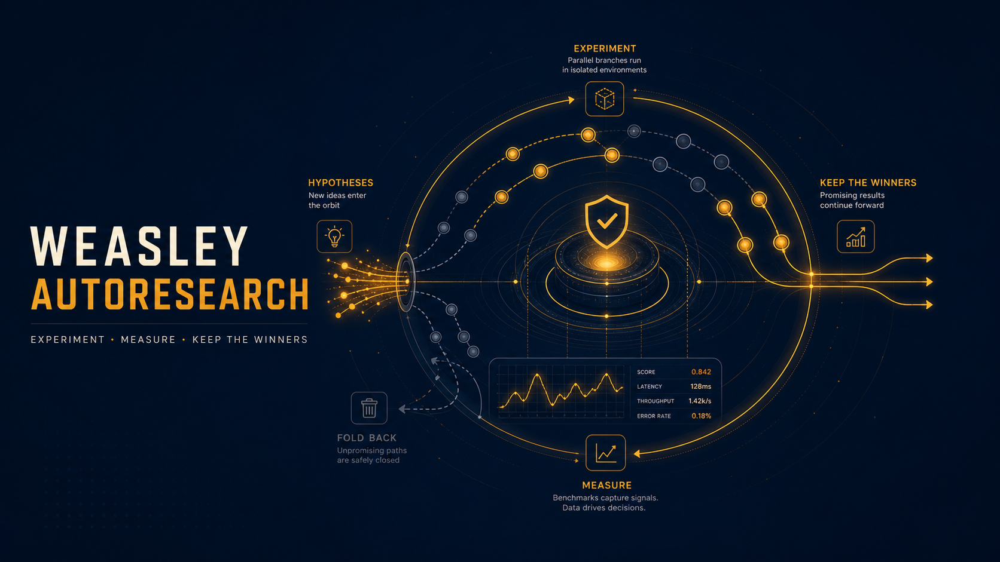

# Weasley AutoResearch



`weasley-autoresearch` is a guarded autonomous experiment loop for the pi coding agent. It turns
an optimization goal into repeatable benchmark runs, records evidence, keeps improvements, and
reverts regressions while preserving an auditable session log. The published package ID remains
`weasley-autoresearch`.

## Features

- `init_experiment`, `run_experiment`, and `log_experiment` tools for measured iteration.
- Live terminal widget, fullscreen dashboard, confidence scoring, and JSONL session history.
- Correctness backpressure through optional `.auto/checks.sh`.
- Before/after hooks for research context, notifications, and learning journals.
- Automatic continuation across agent turns and context compaction, with bounded safety guards.
- Optional redirected working directories for isolated worktrees.
- Finalization skill that groups experiment commits into independent review branches.
- Clean-worktree activation guard: existing staged, tracked, and untracked user changes stop
  activation before any later `git add -A`, checkout, or clean operation can touch them.
- Strict configuration parsing: malformed or unknown settings fail closed instead of silently
  falling back to a different directory or iteration policy.

## Requirements

- Node.js 22.19 or newer
- pi and a configured model provider
- Git for experiment snapshots and rollback
- Bash for benchmark/check scripts and the finalize workflow

## Installation

```bash
pi install npm:weasley-autoresearch
```

Pi supplies the extension API, AI, and TUI packages at runtime. They are declared as optional
peers so a standalone npm consumer does not install a second copy of the Pi host; local development
keeps synchronized copies in `devDependencies` for tests.

For local development:

```bash
git clone https://github.com/potatohoney-p/weasley-autoresearch.git
cd weasley-autoresearch
npm install
npm test
```

Start a session from a **clean Git worktree**:

```text
/autoresearch optimize unit test runtime while preserving correctness
```

Other commands:

| Command | Purpose |
|---|---|
| `/autoresearch off` | Stop auto-resume and deactivate experiment tools. |
| `/autoresearch clear` | Remove the session log and reset runtime state. |
| `/autoresearch export` | Open the local live dashboard. |
| `Ctrl+Shift+F` | Open the fullscreen terminal dashboard. |

The shortcut can be changed or disabled in the active Pi agent directory at
`<agent-dir>/extensions/weasley-autoresearch.json`. The default agent directory is
`~/.pi/agent`; `PI_CODING_AGENT_DIR` can override it.

```json
{
  "shortcuts": {
    "fullscreenDashboard": "ctrl+shift+y"
  }
}
```

Set the shortcut to `null` to disable it.

## Session files

All current session artifacts live under `.auto/` in the effective working directory:

| File | Purpose |
|---|---|
| `.auto/prompt.md` | Goal, scope, metric, constraints, and accumulated guidance. |
| `.auto/measure.sh` | Repeatable benchmark that emits `METRIC name=number`. |
| `.auto/log.jsonl` | Append-only config and experiment results. |
| `.auto/ideas.md` | Deferred hypotheses and follow-up ideas. |
| `.auto/checks.sh` | Optional correctness checks run after a passing benchmark. |
| `.auto/hooks/` | Optional `before.sh` and `after.sh` hooks. |
| `.auto/config.json` | Optional working-directory and iteration configuration. |

Legacy flat `autoresearch.*` session files are read only for compatibility with in-flight sessions.

## Configuration

`.auto/config.json` accepts exactly these optional fields:

```json
{
  "workingDir": "../isolated-worktree",
  "maxIterations": 50
}
```

| Field | Rules |
|---|---|
| `workingDir` | Non-empty absolute or cwd-relative path to an existing directory. |
| `maxIterations` | Positive integer; the loop stops when the limit is reached. |

Malformed JSON, wrong types, invalid values, and unknown fields disable activation with an error.
They are never treated as an empty/default config.

## Git safety model

Before both manual and persisted-session activation, the extension runs a read-only Git status
check. `.auto/` and legacy session artifacts are excluded; every other change is treated as user
work. If any such change exists, activation is refused and no files, index entries, or stashes are
modified.

During an active clean session:

- `keep` stages and commits the experiment result.
- `discard`, `crash`, and `checks_failed` revert experiment changes while retaining session files.
- the finalize skill stashes and restores a dirty tree defensively before it creates review
  branches, and rolls created branches back on creation failure.

Use an isolated Git worktree for unattended or high-risk optimization targets.

## Checks and hooks

Create executable `.auto/checks.sh` to validate correctness after each successful benchmark:

```bash
#!/usr/bin/env bash
set -euo pipefail
npm test
npm run lint
```

Optional `.auto/hooks/before.sh` and `.auto/hooks/after.sh` receive a JSON payload on stdin. Their
stdout is delivered to the agent as bounded steering context. Non-zero exits and timeouts are
reported and logged rather than hidden. Examples live in
[`skills/autoresearch-hooks/examples/`](skills/autoresearch-hooks/examples).

## Testing

```bash
npm run test:unit
npm run test:finalize
npm test
```

`npm test` includes both Node tests and the finalize integration suite. The finalize suite requires
Bash, Git, and standard Unix command-line tools. On Windows, run it from Git Bash or WSL; Linux CI
runners can execute it directly.

## Security

- Benchmarks and hooks execute local commands with the current user's permissions.
- AutoResearch can create commits and branches; use a dedicated branch/worktree and review output.
- Existing user changes block activation, but changes made after activation are assumed to belong
  to the experiment session.
- Do not place secrets in prompts, JSONL logs, hook output, or benchmark output.
- Apply least-privilege API keys and set provider-side spend limits for unattended loops.

Report vulnerabilities through the private security channel on the
[`potatohoney-p/weasley-autoresearch`](https://github.com/potatohoney-p/weasley-autoresearch)
repository rather than a public issue.

## Contributing

Keep safety behavior fail-closed, add regression coverage for Git/config changes, and run
`npm test` before opening a pull request. General issues and pull requests are tracked at
[`potatohoney-p/weasley-autoresearch`](https://github.com/potatohoney-p/weasley-autoresearch).

## License

Apache License 2.0. See [`LICENSE`](LICENSE) and [`NOTICE`](NOTICE).
